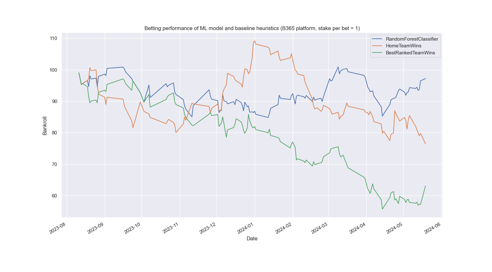

# Football Match Prediction with Machine Learning

As a football fan, I’ve often wondered whether it’s possible to consistently predict match outcomes using machine 
learning — and, more intriguingly, if those predictions could be leveraged to make money through online betting. 
This repository captures my exploratory journey to answer that very question. Stick around to find out the results!

## Table of Contents
- [Overview](#overview)
- [Project Structure](#project-structure)
- [Installation](#installation)
- [Usage](#usage)
- [Machine Learning Predictors](#machine-learning-predictors)
  - [Features](#features)
- [Betting Simulation](#betting-simulation)
- [Performance Evaluation](#performance-evaluation)
  - [Bankroll Evolution](#bankroll-evolution)
- [Code Testing](#code-testing)
- [Contributing](#contributing)
- [License](#license)

## Overview

This project provides an end-to-end pipeline for predicting football match results. It allows users to load historical 
match data from the web, preprocess it, train Machine Learning (ML) models, and make predictions on future matches. 
A betting module simulates potential gains based on model predictions.

The main components of the project include:
1. **Data Handling and Preprocessing**
2. **Model Training and Prediction**
3. **Betting Simulation**

## Project Structure
```
.
├── configs           # Configuration files for ML models (adjust hyperparameters)
├── data              # Football matches data to be loaded
├── betting.py        # Module for handling the betting simulation based on predictions.
├── game.py           # Handles data structures for football games and results.
├── LICENSE.md        # Information about the MIT license used for this project
├── main.py           # Main script for running the prediction pipeline.
├── predictions.py    # Contains the logic for machine learning model training and making predictions.
├── tests.py          # Unit tests for different parts of the system.
└── README.md         # Project documentation (this file).
```

### File Descriptions:

- **betting.py**: 
  - This script simulates betting strategies based on the predictions generated by the machine learning models. It 
evaluates potential profit or loss based on model confidence and betting odds.
  
- **game.py**: 
  - This module is responsible for managing data related to football matches. It defines the structure for storing game
results and features used for predictions.
  
- **main.py**: 
  - The main entry point for the project. This script coordinates the flow of data, including loading match data, 
running predictions, and triggering the betting simulation.
  
- **predictions.py**: 
  - This script contains the core machine learning logic, from training models using historical data to making 
predictions on future matches.
  
- **tests.py**: 
  - Unit tests to validate the functionality of various modules in the project.

## Installation

To set up this project locally, follow these steps:

1. Clone the repository:
   ```bash
   git clone https://github.com/clemsage/SportsBet.git
   ```
2. Make sure that Python 3.10+ is installed on your system.
3. Install the necessary dependencies:
   ```bash
   pip install -r requirements.txt
   ```

## Usage
To run the prediction pipeline, which includes loading and processing match data, training a machine learning model, 
and placing bets based on the model's predictions, use the following command:
   ```bash
   python main.py --country England --division 1 --start_season 10 --end_season 24 --model_name RandomForestClassifier --match_history_length 3
   ```
This example uses Premier League data from the 2010/11 to 2023/24 seasons. The Random Forest classifier is trained on 
all seasons except the last one (2023/24), which is reserved for testing. You can specify different countries,
divisions, or models by adjusting the arguments.

## Machine Learning Predictors
The system can use various machine learning classifiers to predict match results, such as Decision Trees, Random 
Forests and Logistic Regression. In fact, any classifier from the *scikit-learn* package can be passed to the 
`model_name` argument. 

The model hyperparameters can be adjusted in the JSON files within the `config` folder. For example,
the number of trees in the random forest can be changed by modifying the `n_estimators` parameter within the 
`RandomForestClassifier.json` file:
```json
{
  "n_estimators": 100
}
```

### Features
These models are trained on features derived from historical match data. The key features for each match include:
* **Home** team features:
  * Number of matches played in the current season
  * Average points per match
  * Current league ranking
  * Performance in recent home matches (win, loss, or draw) weighted by the corresponding bookmaker odds. 
This is used to assess the team's current form. The number of past matches considered is controlled by the 
`match_history_length` argument (by default set to 0).
* **Away** team features: 
  * Same as the home team features, but only for matches played as the away team.
* Direct Confrontations:
  * The outcome of recent head-to-head encounters between the two teams. The number of confrontations to 
  consider is set by the `number_previous_direct_confrontations` argument (by default set to 3).

#### Additional Feature Ideas
You can extend the model with more complex features, such as:
* Considering not only the outcome (win, lose, or draw) of past matches, but also the goals scored and conceded.
* Creating more sophisticated team form metrics, e.g. [MF index (in French)](
https://www.maxifoot.fr/club/forme-equipe-europeenne.htm)
* Integrating external data, such as key player injuries or team morale, to enhance predictions.

## Betting Simulation
The system finally leverages the ML predictions for betting on match results. It simulates the potential profit 
or loss based on model prediction confidence and betting odds. It follows these rules:
- **Betting Platform:** You can choose the platform where bets are placed using the `betting_platform` argument (default: Bet365).
- **Initial Bankroll:** Set the starting balance for the betting simulation using the `initial_bankroll` argument (default: 100).
- **Stake Per Bet:** The stake is uniform across all bets and is specified by the `stake_per_bet` argument (default: 1).
- **Bet Placement:** At most one bet is placed per match, either on the most likely result or based on value betting criteria.
- **Value Betting:** If the `do_value_betting` argument is enabled, the system only places bets on match outcomes where the predicted probability multiplied by the bookmaker’s odds is greater than 1. This suggests the result has a higher expected return than the implied odds. If not selected, the system bets on the most likely outcome for each match.

The betting simulation is run over the same period as for the ML model testing, i.e. the last season.

## Performance Evaluation
The model prediction accuracy on the training and test sets is printed in the console. Here's an example of the output:
```
Training of the model on 2569 matches from 1011 to 2223 seasons...
Training accuracy of the model: 1.000

Evaluation of the model on 212 matches from the season 2324...
Test accuracy of the model: 0.509
Test accuracy of the HomeTeamWins heuristic: 0.467
Test accuracy of the BestRankedTeamWins heuristic: 0.500
```
### Bankroll Evolution

Beyond accuracy, the system evaluates financial performance by tracking the evolution of the bankroll during the betting simulation. The bankroll represents how much money is gained or lost over time based on the model’s predictions.

Below is an example plot showing the bankroll progression when using the command from the [Usage](#usage) section. Keep in mind that results may slightly vary due to randomness in the RandomForest model’s seed:



### Key Insights

- **Accuracy Isn’t Everything:** While model accuracy is important, it does not always equate to financial success in betting. A model with higher accuracy might not exploit favorable odds effectively. The comparison between the two heuristic baselines highlights this point.
- **Close to Break-Even:** In most scenarios, including the example above, the system ends up close to break-even when using a machine learning classifier. While it sometimes generates a profit, it can also result in a loss, depending on the season or league.
- **Need for Future Improvements:** Although the current system provides a solid foundation, further refinements are needed to achieve consistent profitability and financial independence through betting.

### Next Steps

To improve the system’s financial performance, consider the following approaches:

- **Test Across Different Leagues and Seasons:** Assess the system's consistency by applying it to other leagues and seasons.
- **Optimize Model Selection and Hyperparameters:** Experiment with different machine learning models and tune their hyperparameters for better results.
- **Increase Training Data:** Train the models on larger datasets by merging seasons from multiple leagues.
- **Enhance Features:** Revisit and improve the [features](#additional-feature-ideas) used in the model to capture more predictive factors.
- **Advanced Betting Strategies:** Explore strategies like the **Kelly criterion** or dynamic stake sizing to manage risk and potentially maximize returns.

## Code Testing
Unit tests are included in the `tests.py` file. To run the tests, execute the command:

```bash
python -m unittest tests.py
```

Currently, we only test the ability of the system to correctly track the team statistics throughout a season. But, tests
related to the predicting models and betting mechanism would also be worth being added.

## Contributing
Contributions are welcome! Feel free to submit a pull request or open an issue.

## License
This project is licensed under the MIT License. See the LICENSE file for details.